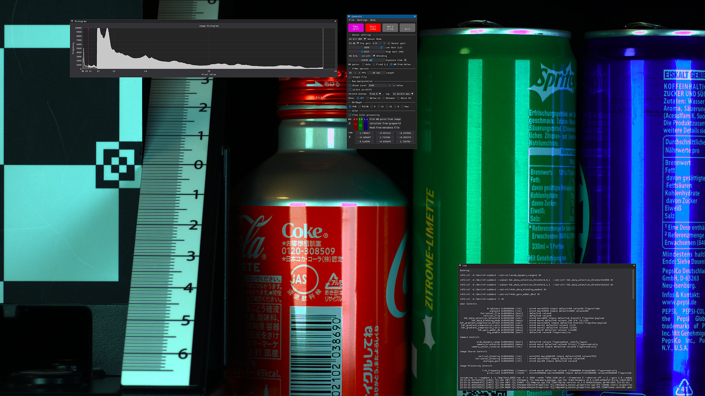

# IMX585 Tools
Utilities for testing various capabilities of IMX585 sensor on Raspberry Pi.

Related to yet undisclosed episode of [Collimated Beard channel](https://www.youtube.com/@collimatedbeard).

All utilities are able to work locally on Raspberry Pi or remotely through SSH. If you want to run it from other machine, please configure key auth so you don't need to hardcode your credentials into python file. Look up "ssh key login" on your favourite search engine.

## Usage
All inner workings of the program will be explained in future video, please keep an eye out.
If you are here and have IMX585 board working, feel free to test all options.

## Install
This program relies on few libraries to work, you can install them using PIP:
```shell
pip install -r requirements.txt
```

In order to run this on a remote desktop you must setup everything to be able to login over SSH to your PI.
```shell
ssh cinepi # This should work without asking you for username and password. 
           # ("cinepi" is host name of Raspberry Pi machine)
```

After dependencies are installed, you can run program without parameters.
```shell
python 585Multitool.py
```
By default, it will try to connect to host "cinepi". You can specify different hostname as first parameter:
```shell
python 585Multitool.py hostname
```

To run in local mode directly on Pi, please edit source and change "ssh_mode":
```python
ssh_mode = False 
```

If everything starts up successfully, you should see main interface of the program:



This is a fullscreen application, ideally viewed on 4K screen so you can see the details of the image.


_Tip: not everything is working yet._

